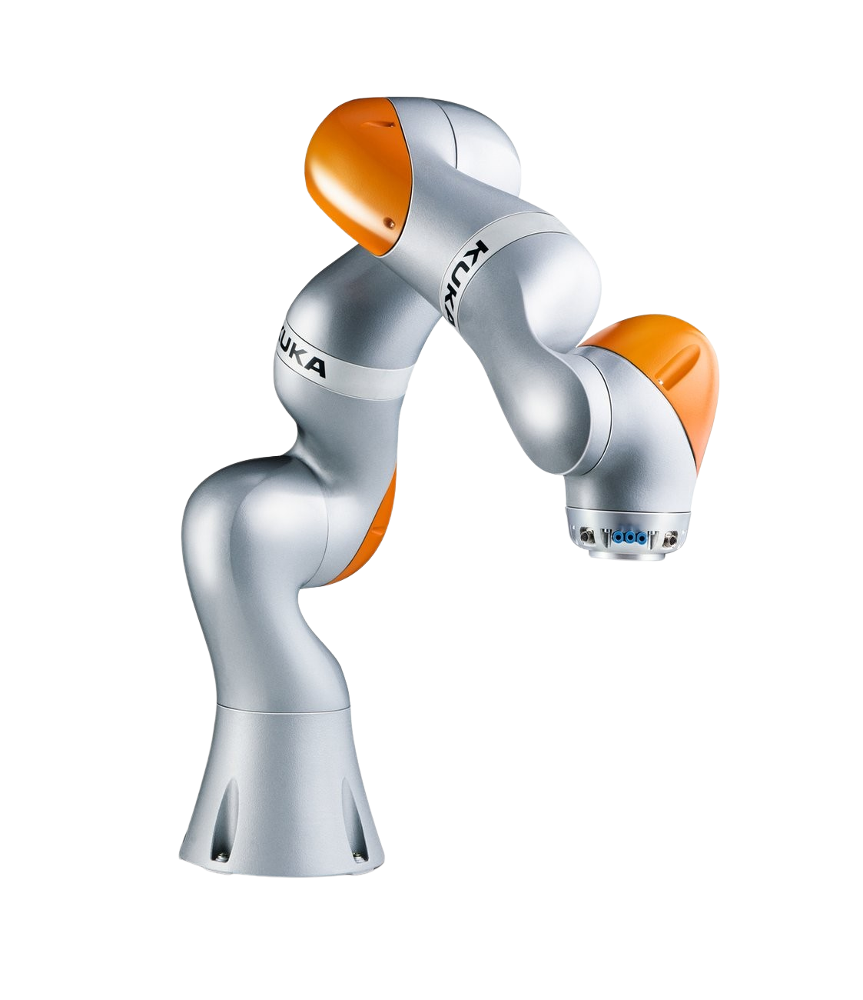

:github_url: https://github.com/based-robotics/mjinx/tree/docs/github_pages/docs/introduction.rst

***********
Quick start
***********

Inverse kinematics (IK) is the problem of finding desired joint configurations given a desired system state. `mjinx` simplifies the task of defining the desired (and undesired) system state using `Components`, and provides variety of solvers to solve the resulting problem.

The core ideas would be demonstrated using a 7 DoF manipulator `Kuka iiwa 14`

.. code-block:: python
   
   from robot_descriptions.iiwa14_mj_description import MJCF_PATH 
   mj_model = mj.MjModel.from_xml_path(MJCF_PATH)
   mjx_model = mjx.put_model(mj_model)
   ee_name = "link7"

   
   Fig 1. Kuka Iiwa 14 manipulator.

Building the problem
====================

To start composing the problem, you need to create the instance of the :class:`Problem <mjinx.problem.Problem>` class, which takes a `mujoco.mjx.Model`:

.. code-block:: python
   
   problem = Problem(mjx_model)

Each problem is composed via _Components_. They always represent a function, but those functions have different meaning and purpose for each of component. However, all of them has name, gain (a.k.a weight in the problem), and mask to select desirable elements among all that component might include. For the details, see :class:`Component <mjinx.components._base.Component>`. 

Task component
^^^^^^^^^^^^^^
Let's start with the *desired behavior*. In `mjinx` it could be specified using notion of :class:`Task <mjinx.components.tasks._base.Task>`. `Task` represents a non-negative function of state and time :math:`f(q, t)`, which controller should keep as close to :math:`0` as possible. The weight of the tasks are specified by two parameters:

1. `gain` -- weight of the function :math:`f` itself. It's common for all the components.
2. `cost` -- weight of the residual in velocity space, used only by :class:`Local IK Solver <mjinx.solvers._local_ik.LocalIKSolver>`.

Suppose, you want to solve a task of moving an end-effector in a desired position. In `mjinx`, you can do it by adding a :class:`FrameTask <mjinx.components.tasks._obj_frame_task.FrameTask>` which is defined for the end-effector:

.. code-block:: python
   
   frame_task = FrameTask(name="ee_task", cost=1, gain=20, body_name=ee_name)
   problem.add_component(frame_task)

Simple, isn't it? However, it is possible to specify the desired behaviour even further. For example, it would be nice if robot would move as little as possible. Then, it's possible to add joint regularization task :class:`JointTask <mjinx.components.tasks._joint_task.JointTask>`:

.. code-block:: python

   joint_task = JointTask("regularization", cost=1e-1, gain=0)
   problem.add_component(joint_task)

Barrier component
^^^^^^^^^^^^^^^^^

Apart from specifying *desired* behavior, usually it's necessary to avoid *undesired* one: the one, which should never occur under any circumstances. `mjinx` handles it by introducing :class:`Barrier <mjinx.components.barriers._base.Barrier>`. `Barrier` represents a function :math:`h(q, t)`, that has to be strictly greater than zero: :math:`h(q, t) > 0`. Its weight is specified by only `gain` parameter.

For example, very natural thing to ask -- don't break joint limits. The :class:`JointBarrier <mjinx.components.barriers._joint_barrier.JointBarrier>` could handle this:

.. code-block:: python

   joints_barrier = JointBarrier("jnt_barrier", gain=10)
   problem.add_component(joints_barrier)

Finally, when we done bulding :class:`Problem <mjinx.problem.Problem>`, it's time to compile it as follows:
.. code-block:: python

   problem_data: ProblemData = problem.compile()

This command will compile all the components (compiling :class:`Component <mjinx.components._base.Component>` means building corresponding :class:`JaxComponent <mjinx.components._base.JaxComponent>`) and return instance of :class:`ProblemData <mjinx.problem.ProblemData>`. This action is required each time we change a :class:`Component <mjinx.components._base.Component>`, for exampe desired frame in :class:`FrameTask <mjinx.components.tasks._obj_frame_task.FrameTask>`. 

Solving the problem
===================

Solver
^^^^^^

To solve the resulting problem, we need some solver. All solvers are derived from the :class:`Solver <mjinx.solver._base.Solver>` class. Let's take, for example, :class:`LocalIKSolver <mjinx.solver._local_ik.LocalIKSolver>`:
.. code-block:: python

   solver = LocalIKSolver(mjx_model, maxiter=20)
   solver_data = solver.init()

The `solver_data` contains arbitrary data structure, where solver could store and update it's internal state. For example, :class:`LocalIKData <mjinx.solver._base.LocalIKData>` stores a previous solution for a warm start.

Now, to solve the problem, we need to provide solver with state `q`, `solver_data`, and `problem_data`:

.. code-block:: python

   opt_solution, solver_data = solve_jit(q, solver_data, problem_data)

`opt_solution` always contains optimal joint velocity `v_opt`, but might additionally contain other paraters, for example `status` and `error` for the :class:`LocalIKSolution <mjinx.solver._base.LocalIKSolution>`.
 

Configuration utilities
^^^^^^^^^^^^^^^^^^^^^^^
Usually, those problems are solved in the loop. Therefore, we need a way to update the state of the model. The :mod:`mjinx.configuration` module contains many utility functions that are used all over the `mjinx`, and also might be useful for you. As such, the function :func:`mjinx.configuration.integrate <mjinx.configuration.integrate>` allows to integrate system using the model integrator and taking into account joint types.

As such, we could update our state and get new configuration:

.. code-block:: python 

   q = mjinx.configuraiton.integrate(
      mjx_model,
      q,
      velocity=opt_solution.v_opt,
      dt=dt,
   )

Loop the previous two steps, optionally update `Task`'s desired positions, and you get a velocity controller for the manipulator!

Jax Magic
=========
Reasonable question might arise: but where does `jax` advantage comes into play? 

The key thing to keep in mind that all methods of `Solver` class and `configuration` functions are jax-compatible. This implies that, for example, you can jit-compile them:

.. code-block:: python

   solve_jit = jax.jit(solver.solve)
   integrate_jit = jax.jit(integrate)

Or you can do automatic vectorization, even for components of the problem:

.. code-block:: python

   # Vmap init function
   solver_data = jax.vmap(solver.init, in_axes=0)(v_init=jnp.zeros((N_batch, mjx_model.nv)))

   # Create an empty (filled with None) problem_data and set vmap-ed fields via axes to vmap along
   # The empty_problem_data would be a 
   with problem.set_vmap_dimension() as empty_problem_data:
      empty_problem_data.components["ee_task"].target_frame = 0

   # Vmapping solve and integrate functions.
   solve_jit = jax.jit(
      jax.vmap(
         solver.solve,
         in_axes=(0, 0, empty_problem_data),
      )
   )
   integrate_jit = jax.jit(jax.vmap(integrate, in_axes=(None, 0, 0, None)))

This example will result in parallel computation of many desired trajectories at once.